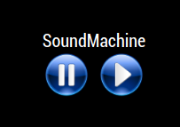

## MMM-SoundMachine

Sleep, relax, concentrate or meditate to your own favorite sounds.

## What you get

It's pretty simple really. It's more about the idea than the complexity of the module

* One default sound of the rain and beach. (My personal favorite)
* Pause and play buttons. (Requires the ability to click)
* Customizable config and css
* Add your own favorite relaxing mp3 files

## Caveat

Sound files can be rather large. That is why I only provided one. I worked at getting
shorter, smaller sound files to loop seamlessly and I asked for help. There is no apparent solution
to this very common problem. So, please acquire your favorite mp3 sounds or use the one provided.

## Examples




## Installation

* `git clone https://github.com/mykle1/MMM-SoundMachine` into the `~/MagicMirror/modules` directory.

* mp3 sound files all go in the MMM-SoundMachine/sounds folder. One is provided.

* No API key needed! No dependencies needed! No kidding!


## Config.js entry and options
```
{
    module: 'MMM-SoundMachine',
    header: "",
    position: 'bottom center',
    config: {
        sounds: 'Rain&Waves', // Just the name of the mp3, not the extension
        statement: "SoundMachine",
    }
},
```
